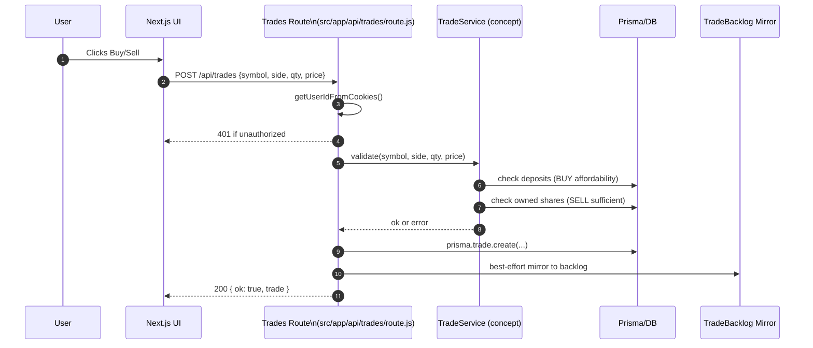
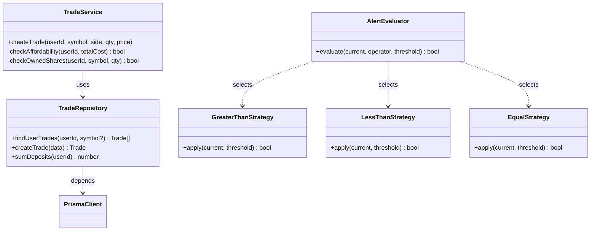
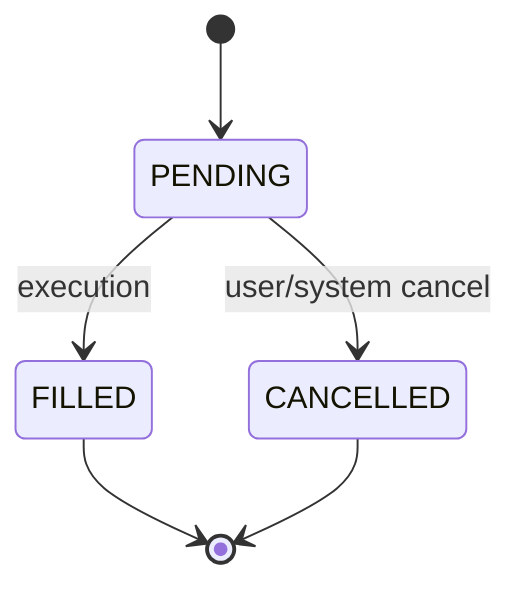

# OmniTrade Design Patterns (RESTful Architecture)

This document explains how OmniTrade applies design patterns with a focus on “RESTful service” design, and highlights supporting patterns we use (or can adopt) to keep the codebase scalable, testable, and resilient.

- Framework: Next.js 15 (App Router)
- API: Next.js Route Handlers under `src/app/api/**`
- DB: Prisma ORM (`src/utils/prisma.js`) against SQLite (with planned Supabase mirror for trade backlog)
- Client: React components with TailwindCSS


## Why RESTful fits OmniTrade best

OmniTrade exposes clear resources via HTTP:
- Users: `/api/admin/users` (admin), `/api/auth/*` (self-service auth)
- Trades: `/api/trades`
- Portfolio: `/api/portfolio`
- Watchlist: `/api/watchlist` and `/api/watchlist/toggle`
- Alerts: `/api/alerts`
- Bookmarks: `/api/bookmarks`
- Deposits/Withdrawals: `/api/deposit`, `/api/withdraw`
- Market Data and News: `/api/marketdata`, `/api/news`, `/api/news/company`

Each route uses HTTP verbs for intent (GET: read, POST: create, etc.), is stateless, and returns JSON. This aligns perfectly with a trading app’s needs: simple, cacheable reads and clear lifecycle operations.


## Layered architecture mapping

We follow a straightforward layered approach. This keeps concerns isolated and enables testing/mocking at each layer.

- Presentation (UI): `src/app/**` pages + client components in `src/components/**`
- API layer (Controllers): `src/app/api/**/route.js` handle requests, auth, validation, responses
- Domain/Services: currently live partly inside API handlers; can be extracted to `src/lib/services/**` as the codebase grows
- Data access (Repositories): Prisma calls via `src/utils/prisma.js`
- Integrations: Finnhub wrappers under `src/lib/finnhub/**`, HTTP resiliency under `src/lib/http/**`
- Cross-cutting: caching `src/lib/mcache.js`, auth helper `src/utils/auth.js`


## Key patterns we use (or can adopt)

1) RESTful Resource Controllers
- Pattern: Controller per resource, thin orchestration + validation, JSON responses.
- Where: `src/app/api/*/route.js` (e.g., `src/app/api/trades/route.js`). Implements auth, input checks, business rules, then calls Prisma.

2) Singleton (PrismaClient)
- Pattern: Single DB client instance per process.
- Where: `src/utils/prisma.js`
- Why: Avoids exhausting DB connections in dev/hot-reload while keeping a single point of configuration/logging.

3) Repository / Data Mapper (with Prisma)
- Pattern: Encapsulate persistence operations behind repository-like calls.
- Where: Today, routes call `prisma.*` directly. As logic grows, extract into `src/lib/repositories/*Repository.js` to isolate queries and ease unit testing.

4) Service Layer
- Pattern: Consolidate domain logic (validations, invariants, side-effects) into services.
- Where: Logic for affordability checks, owned-shares checks, and trade-backlog mirroring currently resides in `src/app/api/trades/route.js`. Extracting into `TradeService` will reduce duplication and enable reuse from jobs or future endpoints.

5) Strategy (Alert evaluation operators)
- Pattern: Encapsulate interchangeable behaviors (>, <, >=, <=, ==) as strategies.
- Where: `src/app/api/alerts/route.js` stores operator and threshold. A future `AlertEvaluator` can map operators to functions, improving clarity and testability for alert checks.

6) Cache-aside (in-memory)
- Pattern: Read-through cache: on miss, fetch and populate; on error, optionally serve stale.
- Where: `src/lib/mcache.js` provides `getCache`, `setCache`, and `fetchJsonCached` with graceful stale fallbacks (even on 429s).

7) Retry with backoff (Resilience)
- Pattern: Retrying after rate limits or transient failures.
- Where: `src/lib/http/fetchWithBackoff.js` shows a simple 429 retry-after flow. Can be extended to exponential backoff and circuit-breakers if needed.

8) Facade for External APIs
- Pattern: Thin wrapper that provides a consistent interface and hides vendor specifics.
- Where: `src/lib/finnhub/news.js` hides token plumbing and result normalization for Finnhub.

9) Guard/Authorization
- Pattern: Request guards that short-circuit unauthorized calls.
- Where: `src/utils/auth.js` (`getUserIdFromCookies`, `requireUserId`) used by API routes.


## Mermaid diagrams

### 1) System architecture (layered, RESTful)
```mermaid
flowchart LR
  subgraph Client [Client (Next.js UI)]
    C1[Pages & Components\n src/app/**, src/components/**]
  end

  subgraph API [API Layer (Controllers)]
    A1[/Trades\n src/app/api/trades/route.js/]
    A2[/Alerts\n src/app/api/alerts/route.js/]
    A3[/Watchlist\n src/app/api/watchlist/**/]
    A4[/Auth\n src/app/api/auth/**/]
    A5[/MarketData & News\n src/app/api/marketdata/**, /news/**/]
  end

  subgraph Domain [Domain / Services]
    S1[Trade logic\n validations, mirroring]
    S2[Alert evaluator\n (operators as strategies)]
  end

  subgraph Data [Data Access]
    D1[(PrismaClient)\n src/utils/prisma.js]
    D2[(SQLite DB)]
  end

  subgraph X [Integrations]
    X1[ Finnhub Facade\n src/lib/finnhub/news.js ]
    X2[ HTTP Backoff\n src/lib/http/fetchWithBackoff.js ]
    X3[ In-memory Cache\n src/lib/mcache.js ]
  end

  C1 -->|HTTP JSON| A1
  C1 -->|HTTP JSON| A2
  C1 -->|HTTP JSON| A3
  C1 -->|HTTP JSON| A4
  C1 -->|HTTP JSON| A5

  A1 --> S1
  A2 --> S2

  S1 --> D1
  S2 --> D1
  D1 --> D2

  A5 --> X1
  A5 --> X2
  A5 --> X3
```


### 2) Sequence: place trade (POST /api/trades)



### 3) Class diagram: services, repositories, strategies



### 4) State diagram: Trade lifecycle



## What is the “best” pattern here?

- Primary: RESTful resource-oriented service with a Layered Architecture. This gives us predictable URLs, clear CRUD semantics, easy caching, and thin controllers.
- Supporting: Singleton (Prisma client), Cache-aside, Retry/Backoff, Facade for external APIs, and Strategy for alert operators.
- Evolution: As the code grows, extract a Service Layer and Repositories to isolate business rules and enable richer unit tests without touching the DB.

This combination keeps the platform simple today and scalable tomorrow.


## Concrete references in this repo
- Prisma singleton: `src/utils/prisma.js`
- Auth guard: `src/utils/auth.js`
- Trades controller: `src/app/api/trades/route.js`
- Alerts controller: `src/app/api/alerts/route.js`
- Cache-aside: `src/lib/mcache.js`
- Retry/backoff: `src/lib/http/fetchWithBackoff.js`
- Finnhub facade: `src/lib/finnhub/news.js`


## Optional next steps
- Extract `TradeService` and `TradeRepository` from `src/app/api/trades/route.js`
- Introduce `AlertEvaluator` with operator strategies
- Add integration tests for service layer and repositories
- Consider a small circuit-breaker around external APIs if rate-limits increase
